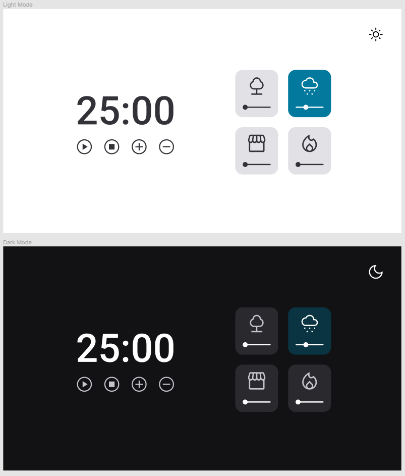

<h1 align="center">My Pomodoro Focus Timer</h1>

A timer with background audio for concentration and application of the pomodoro and lozanov study technique.

  <a href="#-technologies">Technologies</a>&nbsp;&nbsp;&nbsp;|&nbsp;&nbsp;&nbsp;
  <a href="#-project">Project</a>&nbsp;&nbsp;&nbsp;|&nbsp;&nbsp;&nbsp;
  <a href="#-layout">Layout</a>&nbsp;&nbsp;&nbsp;|&nbsp;&nbsp;&nbsp;
  <a href="#memo-license">License</a>

  

 

  

## 🚀 Technologies

This project was developed with the following technologies:

- HTML
- CSS
- JavaScript
- Git e Github
- Figma

## 💻 Project

A simple stopwatch with a great dedign.

## 🔖 Layout

You can view the project layout through [THIS LINK](https://www.figma.com/file/nnUNT3wN59QXONLotsiFfZ/Stage-05---Focus-Timer-2.0-(Copy)?node-id=0%3A4&t=4woSavEdrueOc0m6-0). A [Figma](https://figma.com) account is required to access it.

## :memo: License

This project is lisenced under the MIT license.

---

Made with ♥ [Join our community!](https://discord.gg/rocketseat) :wave:
